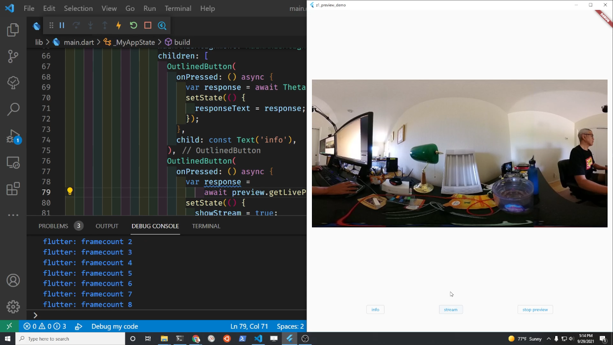

# RICOH THETA Z1 Live Preview Demonstration

Reference to this YouTube video for the tutorial.

https://youtu.be/3rqiXiTvapo

Uses the theta library to build a desktop or mobile app to show
a live preview in 360 degrees.

Information on the library and a command line tool for the API is
available [here](https://community.theta360.guide/t/dart-library-for-ricoh-theta-live-preview-testing/7312?u=craig).
